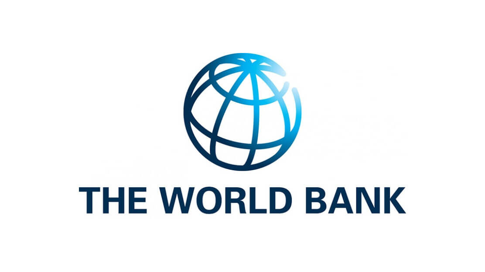

# World Bank

The World Bank is an international financial institution founded in 1944 with the primary mission of reducing global poverty and promoting sustainable economic development in low- and middle-income countries. It comprises two main institutions: the International Bank for Reconstruction and Development (IBRD) and the International Development Association (IDA).

## Objectives

The key objectives of the World Bank include:

1. **Poverty Reduction:** The World Bank aims to reduce poverty by providing financial and technical assistance to countries for projects and initiatives that improve living standards and economic opportunities for the poor.

2. **Economic Development:** It supports economic growth in member countries by investing in infrastructure, education, healthcare, and other critical sectors.

3. **Infrastructure Development:** The World Bank helps member countries build essential infrastructure, such as roads, bridges, energy facilities, and sanitation systems.

4. **Capacity Building:** It assists countries in developing institutional and human capacity to manage their own development effectively.

## Functions

The World Bank fulfills its objectives through various functions, including:

- **Financial Assistance:** It provides loans, grants, and guarantees to member countries for development projects and policy reforms.

- **Policy Advice:** The World Bank offers technical expertise and policy advice to help countries implement effective economic and social policies.

- **Research and Data:** It conducts research on global development issues and provides data and analysis to inform policymaking.

- **Capacity Development:** The World Bank helps strengthen the capacity of governments, institutions, and civil society organizations in member countries.

## Achievements

The World Bank has achieved significant milestones, including:

- **Infrastructure Development:** It has funded and supported the construction of critical infrastructure projects, such as the construction of dams, transportation networks, and power plants.

- **Poverty Reduction:** The World Bank has contributed to the reduction of poverty in many countries by investing in education, healthcare, and poverty alleviation programs.

- **Healthcare Improvement:** It has played a role in improving healthcare systems and access to essential health services in several countries.

- **Education Enhancement:** The World Bank has supported efforts to expand access to education and improve its quality in member countries.

## Challenges

Despite its successes, the World Bank faces several challenges, including:

- **Global Economic Uncertainty:** Economic crises and fluctuations in the global economy can affect the financial resources available for development projects.

- **Country Ownership:** Ensuring that recipient countries take ownership of development projects and reforms is an ongoing challenge.

- **Environmental Concerns:** Balancing development goals with environmental sustainability is a complex challenge, particularly in infrastructure projects.

## Contributions to India

The World Bank has made significant contributions to India, including:

- **Infrastructure Development:** It has financed numerous infrastructure projects in India, such as the construction of roads, railways, and urban infrastructure.

- **Education and Healthcare:** The World Bank has supported India in improving education and healthcare systems, leading to increased access and quality of services.

- **Agricultural Reforms:** It has assisted in agricultural development and modernization efforts in India, helping boost food security and rural livelihoods.

- **Economic Reforms:** The World Bank has provided policy advice and financial support for economic reforms in India, contributing to its economic growth.

---

The World Bank plays a vital role in supporting development efforts in low- and middle-income countries, including India, with the aim of reducing poverty and promoting sustainable development.
