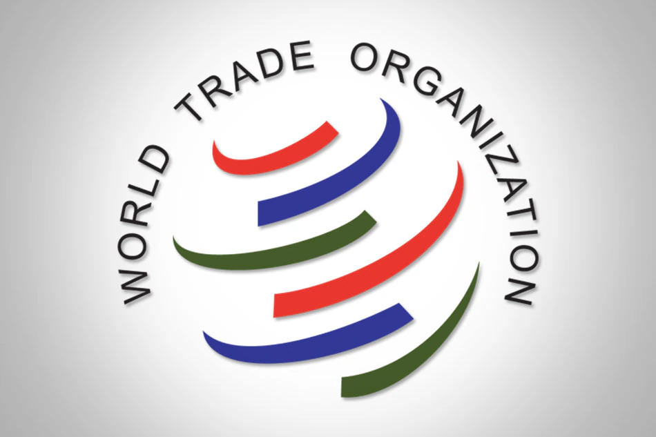

# World Trade Organization (WTO)

The World Trade Organization (WTO) is an international organization established in 1995 to regulate and facilitate international trade among its member countries. It provides a framework for negotiating and implementing trade agreements, settling trade disputes, and ensuring that global trade flows smoothly.

{width=75%}

## Objectives

The key objectives of the WTO include:

1. **Promoting International Trade:** The WTO aims to facilitate the smooth and predictable flow of goods and services across borders by reducing trade barriers and discriminatory practices.

2. **Ensuring Fair Trade:** It seeks to create a level playing field for all countries, ensuring that trade is conducted fairly, transparently, and without discrimination.

3. **Encouraging Economic Growth:** The WTO believes that a well-functioning global trading system can contribute to economic growth, job creation, and poverty reduction.

4. **Providing a Dispute Settlement Mechanism:** The WTO offers a platform for resolving trade disputes among member countries through a rules-based system.

## Functions

The WTO fulfills its objectives through various functions, including:

- **Negotiations:** It conducts negotiations among member countries to create and update trade agreements, such as the General Agreement on Tariffs and Trade (GATT) and the Agreement on Trade-Related Aspects of Intellectual Property Rights (TRIPS).

- **Trade Facilitation:** The WTO works to simplify and streamline customs procedures, reduce trade barriers, and promote transparency in trade-related regulations.

- **Dispute Settlement:** It provides a formal mechanism for resolving trade disputes between member countries through panels and the Appellate Body.

- **Monitoring and Surveillance:** The WTO monitors trade policies and practices of member countries to ensure compliance with established rules.

## Achievements

The WTO has achieved several significant milestones, including:

- **Trade Liberalization:** It has played a crucial role in reducing global trade barriers, leading to increased international trade and economic growth.

- **Dispute Resolution:** The WTO's dispute settlement system has successfully resolved numerous trade disputes, helping maintain a rules-based trading system.

- **Trade in Services:** The General Agreement on Trade in Services (GATS), under the WTO, has facilitated the growth of trade in services like telecommunications and finance.

- **Accession of New Members:** The WTO has expanded its membership to include many new countries, contributing to a more inclusive global trading system.

## Challenges

Despite its successes, the WTO faces several challenges, including:

- **Stalled Negotiations:** The Doha Development Round of negotiations, initiated in 2001, has faced difficulties in reaching a comprehensive agreement, limiting progress in certain areas.

- **Trade Tensions:** Ongoing trade tensions and disputes between major trading partners can disrupt the functioning of the organization.

- **Adaptation to New Trade Realities:** The WTO must adapt to new challenges, such as digital trade and global supply chain disruptions.

## Contributions to India

The WTO has made notable contributions to India, including:

- **Market Access:** India has benefited from increased market access for its goods and services in other countries as a result of WTO agreements.

- **Dispute Resolution:** India has used the WTO's dispute settlement mechanism to address trade disputes with other countries.

- **Intellectual Property Rights:** The TRIPS Agreement under the WTO has provided a framework for India to protect its intellectual property rights while promoting innovation and technology transfer.

- **Trade Facilitation:** India has improved its trade infrastructure and customs procedures in line with WTO trade facilitation efforts, which can lead to reduced trade costs.

---

The World Trade Organization plays a pivotal role in facilitating global trade, promoting economic growth, and resolving trade disputes among member countries, including India.
