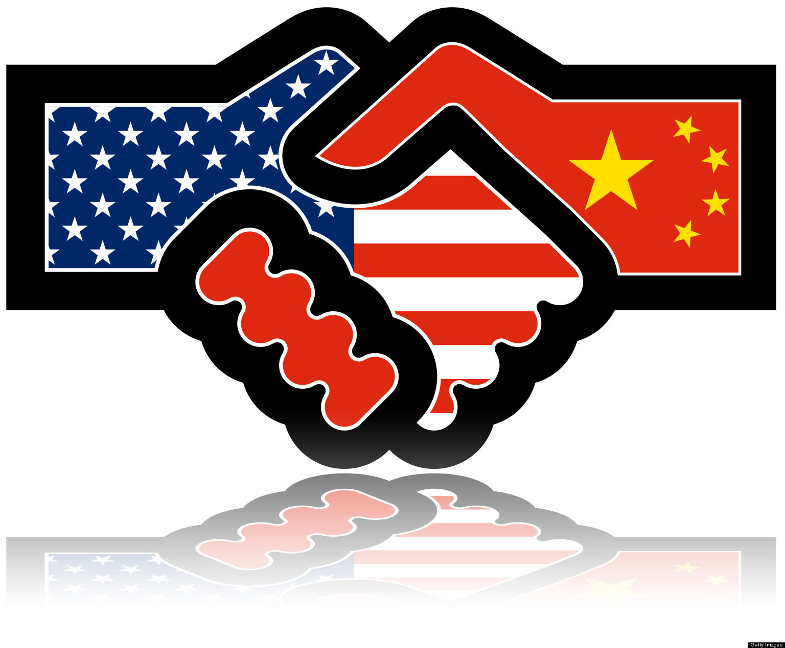

# Diplomacy and Its Role in Peacemaking

Diplomacy is the management of international relations by negotiation and dialogue; it is essential for peacemaking and maintaining peaceful coexistence among nations. Below are key roles that diplomacy plays in the realm of international peace and security:

{width=75% }s

## Conflict Resolution and Negotiation
Diplomacy serves as the primary avenue for conflict resolution, bringing adversaries together to find mutually beneficial outcomes.
- *Example:* The negotiation of the Joint Comprehensive Plan of Action (JCPOA) with Iran was a diplomatic milestone that aimed to diffuse nuclear tensions.

## Mediation
Diplomats often act as neutral parties to help conflicting sides reach an agreement.
- *Example:* Norwegian diplomats were instrumental in mediating the Oslo Accords, a major step in addressing the Israeli-Palestinian conflict.

## Preventive Diplomacy
Diplomacy can anticipate and prevent conflicts from escalating by addressing potential tensions early.
- *Example:* The United Nations often engages in preventive diplomacy across Africa to prevent conflicts and maintain regional stability.

## Peacekeeping and Peacebuilding
Diplomatic efforts are vital in supporting peacekeeping missions that maintain peace and order in post-conflict areas.
- *Example:* UN peacekeeping missions, such as MONUSCO in the Democratic Republic of the Congo, rely on diplomatic support to operate effectively.

## Humanitarian Diplomacy
Diplomats negotiate for humanitarian access and advocate for civilian protection in conflict zones.
- *Example:* Diplomatic efforts have been critical in establishing humanitarian corridors in war-torn areas like Syria.

## Peace Treaties
Diplomatic negotiations are central to drafting and concluding peace treaties to formally end conflicts.
- *Example:* The Dayton Agreement, brokered through intense diplomatic negotiations, successfully ended the Bosnian War in 1995.

## Track II Diplomacy
Informal diplomacy involves non-state actors and can often pave the way for formal negotiations.
- *Example:* The Pugwash Conferences have played a significant role in promoting dialogue and peace efforts outside of official diplomatic channels.

## Multilateral Diplomacy
Multilateral diplomacy brings together various international stakeholders to collectively address complex conflicts.
- *Example:* The Paris Peace Conference of 1919, a massive diplomatic effort following World War I, led to the Treaty of Versailles and the reorganization of international borders.

Diplomacy remains an indispensable tool in international relations for managing and resolving conflicts, promoting stability, and building a foundation for enduring peace. Its multifaceted approach is exemplified by the diverse range of methods and strategies employed to address international issues.
