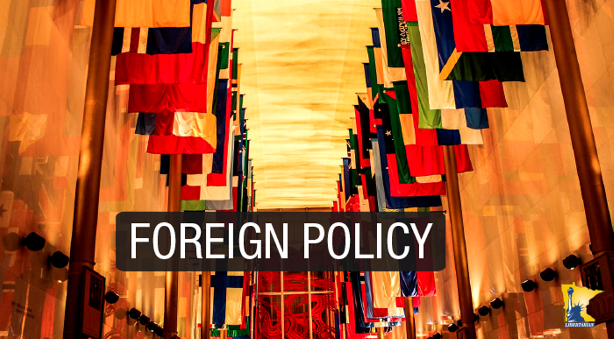

# Foreign Policy

Foreign policy refers to a country's strategy in dealing with other nations. It encompasses a set of principles and actions taken by a nation to achieve its external objectives, safeguard its interests, and interact with other countries and international entities.

## Objectives of India's Foreign Policy

### 1. Preservation of Territorial Integrity and Independence
- Emphasis on protecting national boundaries and maintaining foreign policy independence.
- Efforts include strengthening Afro-Asian solidarity and adopting non-alignment policy.

### 2. Promoting International Peace and Security
- Focus on disarmament and avoiding military alliances to foster global peace.
- Recognition of the interdependence of peace and development.

### 3. Economic Development
- Prioritizing rapid economic growth post-independence.
- Strategic avoidance of power bloc politics for balanced development support.

### Additional Objectives
- Elimination of colonialism and racial discrimination.
- Protecting the interests of Indians abroad.
- Pursuit of a peaceful and stable external environment for economic development.

## Basic Principles of India's Foreign Policy

### A. Panchsheel Principles
Five principles of peaceful co-existence adopted in 1954.
#### Mutual respect for territorial integrity and sovereignty.
It means that each country should respect the territorial integrity and sovereignty of other countries. It also means that no country should interfere in the internal affairs of other countries.i.e. no country should interfere in the internal matters of other countries.
#### Non-aggression.
It means that no country should attack another country.i.e. no country should use force against another country.
#### Non-interference in internal affairs.
It means that no country should interfere in the internal affairs of other countries.
#### Equality and mutual benefit.
It means that all countries should be treated equally and all countries should benefit from each other.
#### Peaceful co-existence.
It means that all countries should live in peace with each other.

### B. Policy of Non-alignment
- Independence in foreign affairs by avoiding military alliances.
- Active role in shaping the Non-Aligned Movement (NAM).

Evolution and Relevance:

- Adaptation of policies to reflect changing global dynamics.
- Continued significance of non-alignment in a post-Cold War, globalized world.
- Active participation in global decision-making and peacekeeping efforts.

### C. Resisting Colonialism, Imperialism, Racism
- Strong opposition to colonialism, imperialism, and racism.
- Active role in anti-apartheid movements and decolonization efforts.

### D. Peaceful Settlement of Disputes
- Commitment to political solutions and peaceful dispute resolution.
- Support for negotiated settlements in various international conflicts.

### E. Support to UN, International Law, and World Order
- Respect for international law and principles of sovereign equality.
- Advocacy for disarmament and reform of UN institutions.

