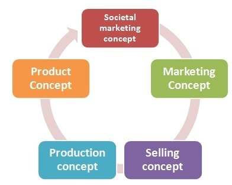

# 6 Marketing Concepts

The marketing concept revolves around a company's strategy to maximize profit by boosting sales, meeting customer needs, and outperforming competitors. The objective is to create a situation that benefits both parties: the customer and the company. These marketing concepts trace their roots back to Adam Smith's book, Wealth of Nations, and have evolved over time. Here are the six core marketing concepts:

## Production Concept

The production concept is based on the assumption that consumers prefer inexpensive and widely available products. This viewpoint aligns with Says Law, which suggests that "supply creates its own demand." Companies following this concept focus on increasing production volume to achieve economies of scale, lowering production costs, and offering affordable products. However, this philosophy may neglect product quality and may not always align with customer preferences.

## Product Concept

The product concept operates under the assumption that customers prioritize product quality over price and availability when making purchase decisions. Companies adhering to this concept invest significant effort in developing high-quality products, often at a higher cost. While this approach appeals to quality-conscious consumers, it may not address other factors influencing purchasing decisions, such as price and availability.

## Selling Concept

The selling concept centers on making immediate sales of a product, regardless of product quality or customer needs. The primary focus is profit generation, often without building long-term customer relationships. Companies following this philosophy may resort to deceptive tactics to drive sales. This short-term approach may not be sustainable and can lead to marketing myopia.

## Marketing Concept

The marketing concept recognizes that to thrive in the 21st century, businesses must create products that meet customer needs. It assumes that consumers buy products that fulfill their needs better than competitors' offerings. Companies embracing the marketing concept conduct research to understand customer needs and develop products that outperform competitors. Building customer relationships and generating long-term profits are key goals. However, this concept is not one-size-fits-all and depends on market dynamics.

## Societal Marketing Concept

Expanding on the marketing concept, the societal marketing concept emphasizes a business's role in promoting societal well-being. It involves meeting customer needs while considering environmental impact, conserving natural resources, and contributing to social causes like poverty alleviation and education. Many major companies include corporate social responsibility in their marketing activities as part of this concept.

## Holistic Marketing Concept

The holistic marketing concept is a modern addition that views a business as a single entity with interconnected parts. It assigns a shared purpose to every activity and individual associated with the business. Just as the various parts of the human body work together for optimal functioning, this concept encourages all facets of a business to collaborate toward a common objective. A holistic perspective aims to achieve the best results by recognizing interdependencies within the organization.
