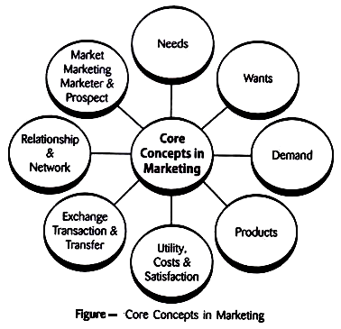

# Core Marketing Concepts

Marketing is a dynamic field that revolves around various core concepts essential for understanding and strategizing in the business world. Let's explore these core marketing concepts in depth:

## 1. Needs

**Needs** refer to the basic human requirements for survival and well-being. These can include necessities like food, shelter, clothing, and healthcare. In a marketing context, identifying and understanding customer needs is crucial for creating products or services that fulfill those requirements.

## 2. Wants

**Wants** are desires or preferences for specific products or services that go beyond basic needs. While needs are essential, wants are driven by individual preferences and can vary widely from person to person. Successful marketers tap into these wants to create appealing offers.

## 3. Demands

**Demands** arise when wants are supported by the ability and willingness to pay for a product or service. In other words, demand is the combination of desire and purchasing power. Marketers strive to stimulate and meet customer demands through effective strategies.

## 4. Products

**Products** refer to tangible items or intangible services that fulfill customer needs or wants. They are at the core of marketing efforts. Understanding the features, benefits, and unique selling propositions of products is vital for marketing success.

## 5. Utility, Costs & Satisfaction

- **Utility** represents the value that consumers derive from a product or service. It can be categorized into four types: form (physical characteristics), time (availability when needed), place (availability where needed), and possession (ease of ownership).

- **Costs** encompass the monetary and non-monetary sacrifices made to acquire a product or service. These can include the purchase price, time spent, and effort expended. Effective marketing aims to maximize utility while minimizing costs.

- **Satisfaction** reflects the level of contentment or pleasure a customer experiences after using a product or service. Satisfied customers are more likely to become loyal and engage in repeat business.

## 6. Exchange, Transaction & Transfer

- **Exchange** is the act of obtaining a desired product or service by offering something of value in return. This mutual benefit is at the core of all marketing activities.

- **Transaction** refers to the actual process of exchanging products or services for money or something of value. Transactions can be one-time purchases or part of an ongoing relationship.

- **Transfer** involves the transfer of ownership or rights related to a product or service from the seller to the buyer. This transfer is a key element of any transaction.

## 7. Relationship & Network

- **Relationship Marketing** emphasizes building and maintaining long-term relationships with customers. It recognizes that repeat customers often contribute more to a company's revenue than new ones.

- **Networks** represent the connections between individuals, organizations, and entities within the business environment. Strong networks can provide valuable resources, information, and opportunities.

## 8. Market , Marketing & Marketer

- **market** is a group of potential buyers who share common needs or wants and have the ability and willingness to make purchases. Markets can be segmented based on various criteria such as demographics, psychographics, or behavior. Effective marketing involves identifying target markets and tailoring strategies to meet their specific needs.

- **Marketing** is the process of planning, executing, and managing activities that create, communicate, deliver, and exchange value to fulfill customer needs and achieve organizational goals. It encompasses a wide range of activities, from market research and product development to advertising and customer relationship management.

- **Marketer** refers to the entity (individual or organization) responsible for creating, promoting, and selling products or services. Marketers play a crucial role in understanding customer needs and delivering value.

## 9. Prospect

**Prospect** represents a potential customer who has shown interest in a product or service but has not yet made a purchase. Marketers engage with prospects through various marketing channels to convert them into customers.

Understanding these core marketing concepts is essential for businesses and marketers to navigate the complex landscape of consumer behavior, competition, and market dynamics. Successful marketing strategies are built on a foundation of meeting customer needs and creating value.