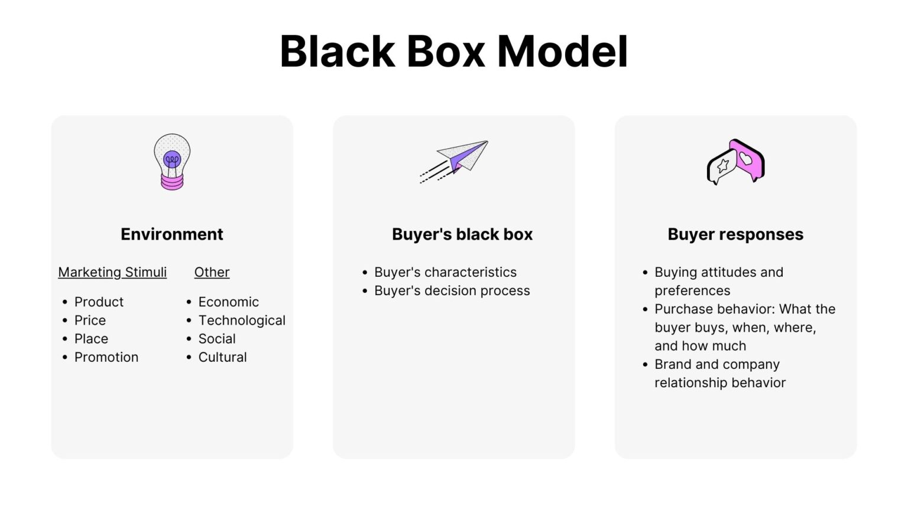

# Black Box Model of Consumer Behavior

The Black Box Model of Consumer Behavior is a valuable framework for understanding how consumers make decisions and how these decisions translate into behaviors. This model was originally devised by Professor Geoffrey Jones and has been expanded upon by other academics. It consists of three major components: Environment, Buyer's Black Box, and Buyer's Responses.

## Three Major Components of the Model

### 1. Environment
The environment in this model encompasses stimuli provided by the firm as well as external stimuli. Marketing stimuli from the firm include elements of the marketing mix, such as advertising messages. External stimuli refer to factors in the broader marketing environment that indirectly influence consumers. It's important to differentiate between "environment" and "people" in this context, as people influence choices but cannot create decision situations themselves.

### 2. Buyer's Black Box
The "black box" represents the internal decision-making process of the buyer, who may not fully understand all the factors influencing their choices. Within the black box, the customer considers past experiences, beliefs, desires, and objectives when making a buying decision. It includes personal preferences and attitudes toward the product-market fit and the value creation process.

#### Buyer's Characteristics
Buyer characteristics are closely connected to the buyer's black box. These characteristics depend on factors like information and motivation. Buying characteristics tend to be relatively stable over time, although personal preferences may change during a person's lifetime due to early influences. These characteristics are shaped by others' information, purchase behavior, and brand attitudes.

#### Buyer's Decision Process
The buyer's decision process involves a sequence of steps that the buyer follows when making a purchase decision. These steps include concept selection, search, evaluation and selection (SEES), evaluative experience, calculating purchase motives, and adaptation to new feelings about the product over time. Understanding the mentality, needs, and expectations of buyers is crucial for pricing decisions, as it may not always show a direct association between quality perceptions and buying motives.

### 3. Buyer's Responses
After purchase, the buyer's responses can be influenced by the product's performance. For example, if a customer has a negative experience, they may suffer from buyer's remorse and seek to make additional purchases to alleviate these negative feelings. However, this is not always the case, as many people make purchases without giving it much thought.

When the sales of a particular brand decline rapidly, it often indicates customer dissatisfaction with their experiences. This lack of demand can decrease the product's value and deter others from buying it. Customer loyalty plays a significant role in returning customers to "solve" their problems, which can positively impact sales. On the contrary, discontinuing a product can negatively affect overall brand image and customer retention.

## Conclusion

The Black Box Model of Consumer Behavior offers valuable insights into how consumers make purchasing decisions. While it may be challenging to pinpoint exactly why someone makes a specific purchase, this model helps deduce relevant patterns in consumer thinking. Businesses can utilize this knowledge to design products and services that meet customer needs and encourage repeat purchases.

Furthermore, the model suggests that consumers may continue buying products they don't necessarily need due to habituation from previous purchases. Therefore, businesses should expect customers to repeatedly purchase the same products. It's important to note that this model primarily focuses on how people make new purchases, rather than repeat ones. Understanding consumer behavior models like this one can provide a comprehensive perspective on consumer decision-making.
