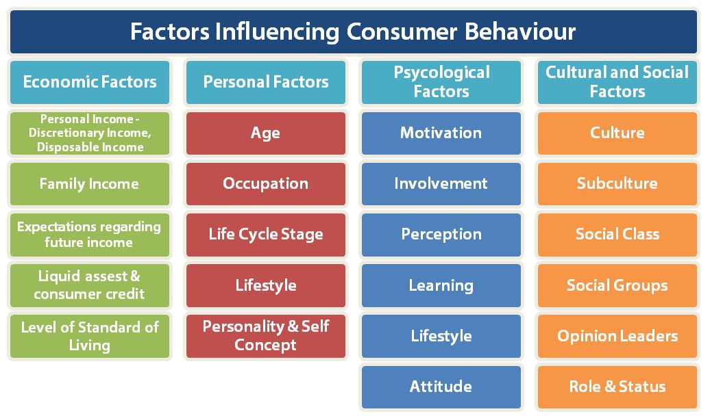

# Factors Influencing Consumer Behavior

Consumer behavior refers to how individuals, groups, and organizations make choices regarding the selection, purchase, use, and disposal of goods, services, ideas, or experiences to satisfy their needs and desires. To understand consumer behavior fully, marketers must consider various factors that influence it. These factors can be broadly categorized into cultural, social, and personal factors.

## Cultural Factors

**Culture:** Culture is a fundamental determinant of an individual's wants and behavior. It encompasses the values, perceptions, preferences, and behaviors acquired through family and key institutions. For example, cultural values like filial piety significantly impact buying decisions.

**Subculture:** Within a culture, there are smaller subcultures based on factors such as nationality, religion, race, and geography. Marketers often tailor their strategies to cater to these subcultures, as their values and preferences can differ significantly.

**Social Class:** Social class divisions within society can influence consumer behavior. People from different social classes exhibit distinct preferences in areas like clothing, leisure activities, and media consumption. Social class can also affect language preferences in advertising.

## Social Factors

**Reference Groups:** A person's behavior is influenced by reference groups, which can be membership groups (family, friends) or aspirational and dissociative groups. Reference groups can shape attitudes and buying choices by exposing individuals to new behaviors and exerting pressure to conform.

**Cliques:** Society consists of cliques, small groups whose members interact frequently. While cliques facilitate communication, they can also insulate themselves from new ideas. Marketers aim to bridge the gap between cliques to encourage information exchange.

**Family:** The family is a crucial consumer buying organization. Both the family of orientation (parents, siblings) and the family of procreation (spouse and children) impact buying decisions. Changing family structures influence purchasing patterns.

**Roles and Statuses:** People occupy roles within various groups (e.g., family, clubs) and have corresponding statuses. A person's role and status influence product choices, as individuals often select products that align with their perceived role and status in society.

## Personal Factors

**Age and Life Cycle:** Consumer preferences often change with age and life stage. Products related to food, clothing, and recreation can be age-dependent. Family life cycle stages and critical life events can also influence buying decisions.

**Occupation and Economic Circumstances:** A person's occupation and economic situation affect their purchasing power and preferences. Economic factors, including income, savings, and debt, play a vital role in product choice.

**Personality and Self-Concept:** Personality traits, such as self-confidence and sociability, can influence brand choices. Consumers often select brands with personalities that match their self-concept or ideal self-concept.

**Lifestyle and Values:** Lifestyle reflects an individual's pattern of living, encompassing activities, interests, and opinions. Marketers target lifestyle groups that align with their products. Core values, underlying belief systems, can also influence long-term purchase behavior by appealing to consumers' inner selves.

Understanding these cultural, social, and personal factors is essential for marketers to develop effective strategies that resonate with consumers and drive desired behaviors.

## Psychological Factors:

1. **Learning**: Learning involves changes in behavior based on experience. Consumers learn from their interactions with products and brands. Marketers can use strategies like reinforcement, repetition, and associative learning to influence consumer behavior. For example, providing positive experiences with a product can reinforce brand loyalty.

2. **Attitudes**: Attitudes represent consumers' overall evaluations and feelings toward products or brands. Marketers aim to create positive attitudes by shaping consumers' perceptions through advertising, product quality, and customer experiences. A positive attitude can lead to brand loyalty and repeat purchases.

3. **Motives**: Motives are the underlying reasons that drive consumer behavior. Understanding consumer motives helps marketers align their products or services with consumer needs. For example, a person's motive for buying a smartphone could be for communication, entertainment, or productivity.

4. **Perception**: Perception is how consumers interpret and make sense of information from their environment. Marketers must consider how their products and messages are perceived by consumers. This includes factors like selective attention, selective distortion, and selective retention. Packaging, branding, and advertising play significant roles in shaping perceptions.

