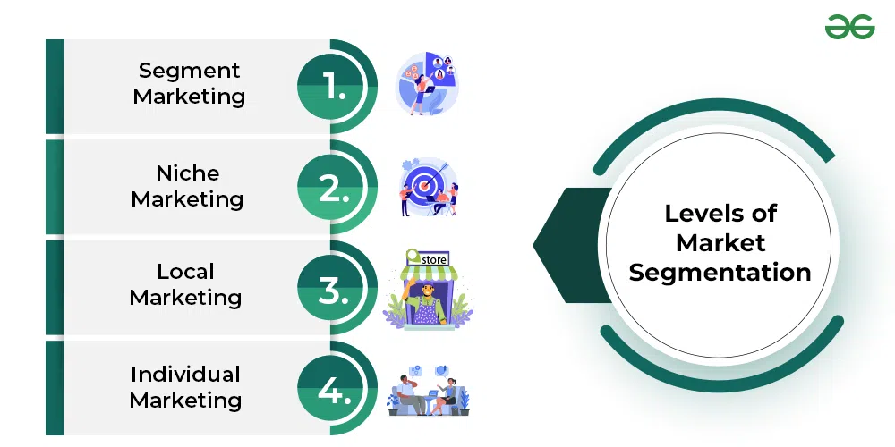
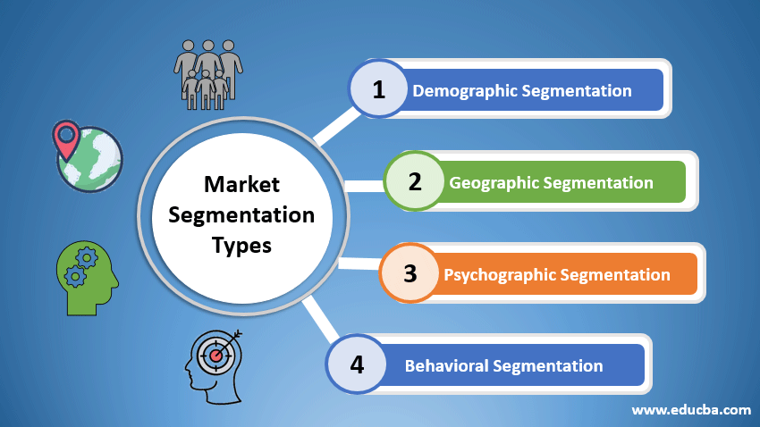

# Market Segmentation

Market segmentation is a fundamental concept in modern marketing, emphasizing a market-oriented strategy and philosophy. It focuses on understanding and catering to the diverse demands of customers. William J. Stanton defines market segmentation as "the process of dividing the total heterogeneous market for a goods or service into several segments, each of which tends to be homogeneous in all significant aspects."

Philip Kotler describes market segmentation as "the act of dividing a market into distinct groups of buyers who might require separate products and/or marketing mixes."

## Market Segmentation Levels

Marketers can subdivide a large market into different segments to make their marketing efforts more effective. The primary levels of market segmentation are:

### Mass Marketing

Mass marketing involves promoting a single product to the entire market with a uniform strategy. It assumes that most people in the market share similar characteristics, behavior, and consumption patterns. This approach is also known as undifferentiated marketing.

Mass marketing entails mass production, distribution, and promotion to all potential buyers, either at the national or international level. While it offers economies of scale and a larger market, it can also lead to intense competition.

### Segment Marketing

Segment marketing divides the entire market into segments based on factors like consumption patterns, purchasing power, geography, and social values. It is also known as differentiated marketing.

Segment marketing allows marketers to address the specific needs of each segment effectively. Companies with diverse product lines often use this strategy. For instance, a car manufacturer may differentiate its cars into low-cost, luxury, and performance-based categories.

### Niche Marketing

Niche marketing is a highly specialized form of segmentation where the marketer focuses exclusively on a specific group of customers with distinct needs, wants, and characteristics. This approach is also called concentrated marketing.

For example, a sports car company may exclusively target sports enthusiasts, ignoring other market segments. Niche marketers provide specialized products and services, often at premium prices.

### Local Marketing

Local marketing targets specific geographic areas, where locally produced products are marketed in the same region. This approach caters to local tastes and preferences.

Local marketers may focus on neighborhoods, communities, or small regions, offering products with local appeal and flavor. While the market size is limited, there is lower competition, and it can be challenging for competitors to enter local markets.

### Individual Marketing

Individual marketing, also known as one-to-one or customized marketing, focuses on satisfying the needs and wants of a single customer. It is a micro-marketing strategy often used in B2B marketing.

In individual marketing, the marketer tailors their offerings to the individual customer's profile, preferences, and buying behavior. This approach is most common when targeting affluent customers with specific needs and high spending habits.

These different levels of market segmentation enable marketers to better align their products and services with the varying demands of their target audience.

Here's the information you provided in Markdown format with appropriate headings:

## Bases for Segmenting Consumer Markets

### Demographic Segmentation

Demographic variables are used to segment the market based on population composition. Key demographic variables include:

- **Age:** Market segmentation can be based on age groups, such as under 5 years, 5 – 10 years, 10 – 15 years, 15 – 25 years, 25 – 40 years, 40 – 60 years, above 60 years, etc.

- **Gender:** Segmentation based on gender, categorizing the market into male, female, and third gender.

- **Income:** Segmentation based on customer income, with categories like low income, average income, and high income.

- **Marital Status:** Segmenting by marital status, including categories like unmarried, married, and divorced.

- **Ethnic Background:** Segmentation based on ethnic background, with examples like Brahmin, Chhetri, Newar in Nepal or Asian, American, white, black in international markets. Other demographic variables can include family life cycle, education, employment, and occupation.

### Geographic Segmentation

Geographic segmentation divides the market based on the location, recognizing that people in similar areas may have similar needs and wants. Geographic variables include:

- **Area:** Segmenting by geographic area, such as local, regional, national, international, etc.

- **Topography:** Segmenting based on the geographical structure, e.g., Himalayan, Hilly, and Terai regions in Nepal.

- **Climate:** Using climate as a basis for segmentation, such as alpine, temperate, etc.

- **Population Density:** Segmenting by population density, which influences demand size, e.g., urban, rural, etc.

### Psychographic Segmentation

Psychographic segmentation focuses on psychological factors and includes:

- **Social Class:** Segmentation based on socio-economic groups like upper-class, middle-class, and lower-class, reflecting different buying habits and consumption patterns.

- **Lifestyle:** Segmenting based on the lifestyle of people, e.g., heavy drinkers, chain-smokers, fashion enthusiasts, etc., each representing a potential market segment.

- **Personality:** Segmenting based on personality characteristics like extraverted, introverted, self-confident, etc., each representing a potential market segment.

### Behavioral Segmentation

Behavioral segmentation utilizes consumer behavioral patterns as bases for market segmentation. Key behavioral variables include:

- **Benefits:** Segmenting based on the benefits sought by customers from a product, incorporating various benefits into the product to meet consumer expectations.

- **Usage Rate:** Segmenting based on the usage rate of the product, including heavy users, medium users, and light users.

- **Brand Loyalty:** Segmenting based on customer loyalty to a specific brand or product, including customers who consistently buy one brand, switch brands, or have no brand loyalty.

These segmentation bases help marketers tailor their products and marketing strategies to better meet the needs and preferences of specific consumer segments.