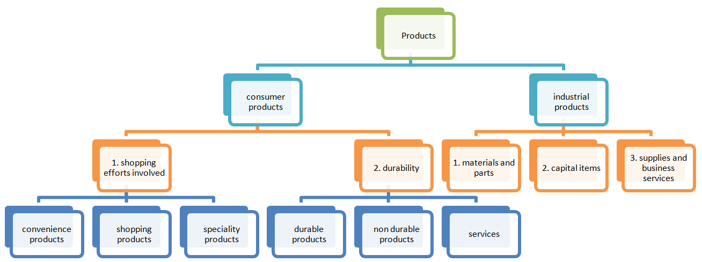

# Classification of Products

Products can be categorized in various ways based on different criteria, offering insights into their characteristics and consumer behavior. Here, we'll explore three primary classifications of products:

## A. Classification Based on Durability and Tangibility

1) Non-Durable Goods

Non-durable goods are products that have a short lifespan and are consumed or used up quickly. These goods are tangible but not built to last. Examples include food items like perishable groceries (e.g., fruits, vegetables), consumable products (e.g., cleaning supplies), and disposable items (e.g., paper towels).

2) Durable Goods

Durable goods are products designed to withstand extended use over time. They have a longer lifespan compared to non-durable goods. These products are tangible and often represent significant investments. Examples include appliances (e.g., refrigerators, washing machines), electronics (e.g., smartphones, laptops), and vehicles (e.g., cars, motorcycles).

3) Services

Services are intangible offerings provided by individuals, businesses, or organizations to meet specific needs or solve problems for consumers. Unlike physical products, services are experiences and cannot be held or touched. Examples include healthcare services, education, financial consulting, and entertainment (e.g., movie theaters, live performances).

## B. Consumer Goods Classification

Consumer goods are products intended for personal use by individuals or households. They are categorized into four main types based on consumer buying behavior:

1) Convenience Goods

Convenience goods are everyday products that consumers purchase frequently with minimal effort. These goods are readily available, and consumers often buy them without extensive research or consideration. Examples include toiletries (e.g., toothpaste, soap), snacks, and basic household items.

2) Shopping Goods

Shopping goods are products that consumers compare and evaluate before making a purchase decision. These items typically require more effort in terms of research and decision-making. Examples include clothing, electronics, furniture, and appliances.

3) Specialty Products

Specialty products are unique or niche items with specific characteristics or brand associations that make them highly desirable to certain consumers. These products often command premium prices, and consumers are willing to exert extra effort to acquire them. Examples include luxury watches, designer clothing, and high-end sports cars.

4) Unsought Products

Unsought products are goods that consumers may not actively seek out or consider purchasing. These products typically require strong marketing efforts to create awareness and generate demand. Examples include life insurance, burial plots, and emergency medical services.

## C. Industrial Products

Industrial products are goods and services purchased by businesses and organizations for operational or production purposes. They can be classified into three main categories:

1) Material and Parts

Material and parts refer to the raw materials, components, and supplies used by businesses to manufacture their products or provide services. Examples include steel, plastics, electronic components, and office supplies.

2) Capital Items

Capital items, also known as capital goods or durable goods, are long-term investments made by businesses to support their operations. These items are typically expensive and have a significant impact on a company's productivity. Examples include machinery, industrial equipment, and commercial vehicles.

3) Supplies and Business Services

Supplies and business services encompass a wide range of products and services that companies require to run their day-to-day operations efficiently. This category includes office supplies (e.g., paper, ink cartridges), maintenance services (e.g., janitorial services), IT support, and consulting services (e.g., legal, financial, marketing).

Understanding these classifications helps businesses tailor their marketing, distribution, and sales strategies to effectively meet consumer needs and achieve their objectives, whether they are focused on consumer goods or industrial products.