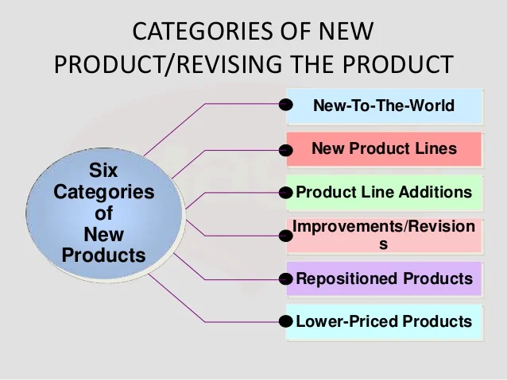

# The Categories of New Products

In the realm of new product development, businesses explore various avenues to stay competitive and cater to evolving consumer demands. The process of introducing new products can be broadly categorized into six distinct categories, each with its own unique characteristics and objectives.

## 1. New-to-the-World Products (Really New Products)

These are the groundbreaking innovations that revolutionize entire industries or create entirely new markets. They represent inventions that were previously unheard of. For instance, the introduction of the Polaroid camera transformed photography, making instant prints possible. Similarly, Apple's iPod and iPad redefined the way we consume and interact with digital media.

## 2. New-to-the-Firm Products (New Product Lines)

In this category, companies venture into product categories that are new to their existing business portfolios. These products may already exist in the market but are introduced by the company for the first time. Often referred to as "new product lines," they broaden the company's offerings. Examples include Procter & Gamble's (P&G) entry into the shampoo or coffee market, Hallmark's expansion into gift items, and AT&T's introduction of the Universal credit card.

## 3. Additions to Existing Product Lines

Additions to existing product lines involve extending the range of products within a particular category. These line extensions are designed to provide consumers with more options or cater to specific market segments. For example, P&G's Tide detergent introduced Tide Liquid detergent to complement its existing product line. Similarly, beer brands like Bud Light introduce new flavors or variations to their product offerings. Kellogg's Special K cereal line also includes snacks, drinks, and snack bars as additions to the original product.

## 4. Improvements and Revisions to Existing Products

This category involves enhancing or revising existing products to make them better or more appealing to consumers. Companies invest in research and development to upgrade product features, improve quality, or modernize designs. For instance, P&G continually revises products like Ivory Soap and Tide power laundry detergent to keep them competitive in the market. These improvements aim to maintain the product's relevance and meet evolving customer expectations.

## 5. Repositioning

Repositioning products involves targeting them for new uses, applications, users, or markets. While some may argue whether repositioning constitutes a genuinely new product, it is considered as part of the new product development process. Repositioning can breathe new life into existing products. For example, Arm & Hammer baking soda was repositioned as a drain and refrigerator deodorant, expanding its utility beyond baking. Aspirin was repositioned as a preventive measure against heart attacks, changing its intended use. Repositioning can also involve shifting the target audience, as seen with Marlboro cigarettes, which transitioned from being marketed as a women's cigarette to a men's cigarette.

## 6. Cost Reductions

Cost reduction products offer similar performance to existing products but at a lower cost. While these products may not seem drastically different, they can result in significant savings for both businesses and consumers. Cost reduction initiatives often involve innovations in design, production processes, or materials. Customers benefit from these products by obtaining similar functionality at a lower price point. It's important to note that cost reductions can also encompass marketing strategies to make the product appear more affordable or valuable to consumers.

In conclusion, understanding the six categories of new products provides businesses with a framework to navigate the complex landscape of innovation. By strategically leveraging these categories, companies can cater to diverse consumer needs, stay relevant in the market, and drive growth through successful new product development.