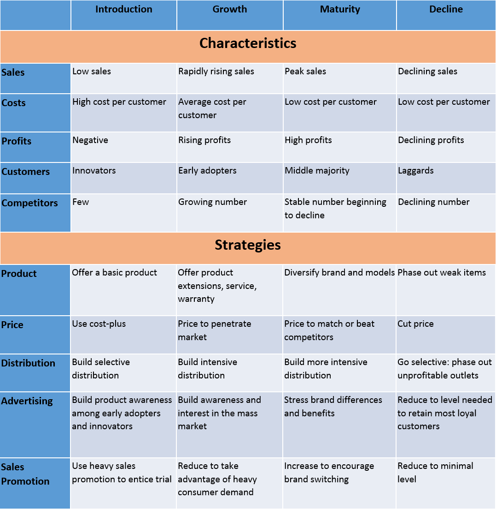

# Product Life-Cycle and Marketing Strategy

The product life-cycle is characterized by the distinction between sales and profit curves. Often, well before sales start to decline, profit margins begin to diminish. To maintain market position, preserve a company's image, and sustain profitability, marketers must continually introduce new products. The product life-cycle influences strategic marketing planning at all levels, encompassing product planning, development, pricing, promotion, and distribution policies.

Effective management of the product life-cycle is essential for the sustained growth and success of a firm. The marketing manager, while forecasting the product life-cycle, should anticipate limitations and drawbacks to formulate successful programs. Below, we discuss how to manage the product life-cycle across various stages.

The product life cycle (PLC) consists of four distinct stages: Introduction, Growth, Maturity, and Decline. Each stage presents unique challenges and opportunities for marketers. Below, we explore these stages in detail, along with the associated marketing strategies.

## Stage 1: Introduction

The introduction stage is the initial phase of a product's life cycle. Sales are limited as the product is new to the market. Companies focus on creating awareness of the product's features, uses, and advantages. Profitability is often low, and investments often exceed revenues.

### **Characteristics**

- **Low Sales Growth:** Sales are typically slow during this stage.

- **High Initial Investments:** Companies invest heavily in research, manufacturing, and marketing.

- **Market Challenges:** Challenges include making the product available, expanding production capacity, and overcoming technical difficulties.

- **Distribution:** Establishing effective distribution channels takes time.

- **Consumer Behavior:** Changing consumer behavior and preferences may be difficult.

### **Marketing Strategies**

1. **Rapid Skimming Strategy:** Set a high initial price to attract early adopters, emphasizing product quality and selective distribution.

2. **Slow Skimming Strategy:** Introduce the product at a high price with limited promotion.

3. **Rapid Penetration Strategy:** Set a low price and aggressively promote the product to capture market share quickly.

4. **Slow Penetration Strategy:** Introduce the product at a low price with minimal promotion.

## Stage 2: Growth

The growth stage witnesses a rapid increase in sales and profits. Competitors enter the market, leading to increased competition. Companies focus on expanding product lines, maintaining a relatively high price, and using advertising and promotions to build brand awareness.

### **Characteristics**

- **Rapid Sales Growth:** Sales increase quickly during this stage.

- **Competition:** More competitors enter the market.

- **Positive Cash Flow:** Despite investments, positive cash flow is generated.

- **Profit Peak:** Profits peak but may start to decline.

### **Marketing Strategies**

1. **Product Line Expansion:** Offer various product models and styles to cater to different customer segments.

2. **Price Maintenance:** Maintain a relatively high price while reaping substantial profits.

3. **Promotion:** Use advertising and promotions to maintain brand awareness and attract new customers.

4. **Market Segmentation:** Target different customer groups to maximize market share.

5. **Warranty and Service:** Modify warranty and service conditions to enhance customer satisfaction.

## Stage 3: Maturity

The maturity stage is marked by steady sales, increased competition, and reduced profit potential. Companies aim to expand product variations, implement cost-effective promotional campaigns, consider price reductions to remain competitive, and explore market segmentation or brand extension.

### **Characteristics**

- **Steady Sales:** Sales growth stabilizes, and sales levels off.

- **Intense Competition:** Competition remains high.

- **Profit Slowdown:** Profit potential starts to decline.

- **Marketing Shift:** Marketing efforts shift from demand cultivation to market entrenchment.

### **Marketing Strategies**

1. **Product Variation:** Offer various product variations to cater to different customer preferences.

2. **Cost-Effective Promotion:** Optimize promotional campaigns to reduce costs while maintaining effectiveness.

3. **Price Management:** Consider price adjustments to remain competitive while protecting profit margins.

4. **Market Segmentation:** Target specific market segments or explore brand extensions.

5. **Customer Loyalty:** Focus on customer loyalty and repeat purchases.

6. **Warranty and Service:** Revise warranty and service conditions based on customer feedback.

## Stage 4: Decline

The decline stage sees declining sales and profits due to various factors, such as changing consumer preferences, technological advancements, or market saturation. Companies must decide whether to rejuvenate the product or discontinue it.

### **Characteristics**

- **Falling Sales:** Sales decline sharply.

- **Excess Capacity:** Firms may face excess production capacity.

- **Reduced Promotion:** Promotion may be reduced or discontinued.

- **Profit Decline:** Profits decrease significantly.

### **Marketing Strategies**

1. **Market Exploration:** Explore new domestic and foreign markets to extend product life.

2. **New Uses:** Identify new uses for the product among existing customers.

3. **Revamp Packaging:** Revamp packaging and convenience to renew interest.

4. **Promotional Efforts:** Invest in promotional activities, discounts, and displays.

5. **Change in Advertising:** Consider changing advertising agencies for fresh marketing approaches.

6. **Product Disposal:** Decide whether to discontinue the product or minimize inconvenience.

Understanding the product life cycle stages and employing appropriate marketing strategies is essential for businesses to adapt to changing market dynamics and maximize the success of their products. Each stage presents unique challenges and opportunities, and effective marketing strategies can help products thrive throughout their life cycles.

## Nestle – Maggi Product Life Cycle Case Study

<!--  -->

**Introductory Stage in the Product Life Cycle of Maggi:**
- Maggi entered the Indian market in 1982, facing no competition in the instant noodle market.
- It segmented its target audience based on age and urban areas, focusing on kids, youth, and office goers.
- The tagline, 'Taste Bhi, Health Bhi,' emphasized the product's quick preparation.
- Marketing efforts aimed at creating product awareness and adapting to Indian tastes.

**Growth Stage in the Product Life Cycle of Maggi:**
- By 1985, Maggi gained consumer acceptance, leading to increased sales.
- Top Ramen entered the market in 1990, posing a minor threat to Maggi's market share.
- Maggi launched a new flavor in 1997, which did not perform well.
- In 1999, it re-launched its original flavor, resulting in increased sales and profits.
- New product variations like ketchup, pasta, soup, and oats were introduced, but the focus remained on the original product.

**Maturity Stage in the Product Life Cycle of Maggi:**
- Maggi faced stiff competition with Top Ramen during this stage.
- To capture a larger market segment, it introduced a 5 rupees packet in 2010, expanding its distribution.
- This strategy allowed Maggi to gain a larger market share and become a household name.
  
**Decline Stage in the Product Life Cycle of Maggi:**
- In 2015, Maggi faced a crisis when it was banned due to high lead content.
- The ban led to the perception that Maggi had entered the decline stage.
- Through effective PR and marketing, Maggi proved its safety for consumption.
- It invested in research, employee engagement, and social media campaigns.
- Maggi exclusively re-launched itself with Snapdeal, offering pre-orders to loyal customers.
- The brand's message, 'Your Maggi is safe, has always been,' helped it regain popularity.
