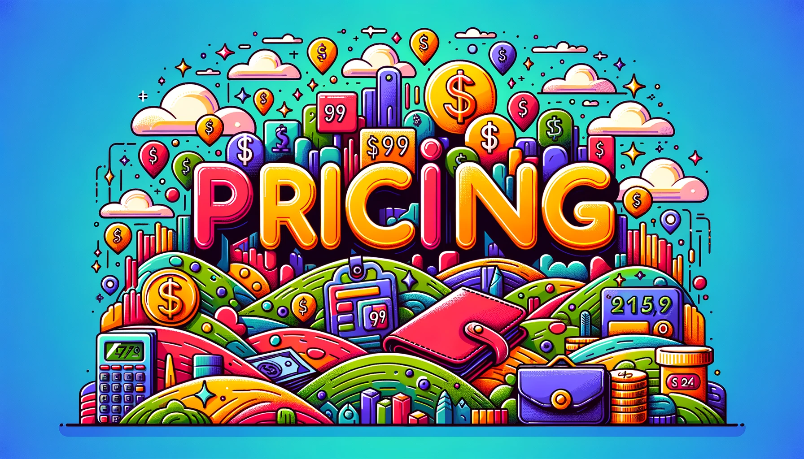
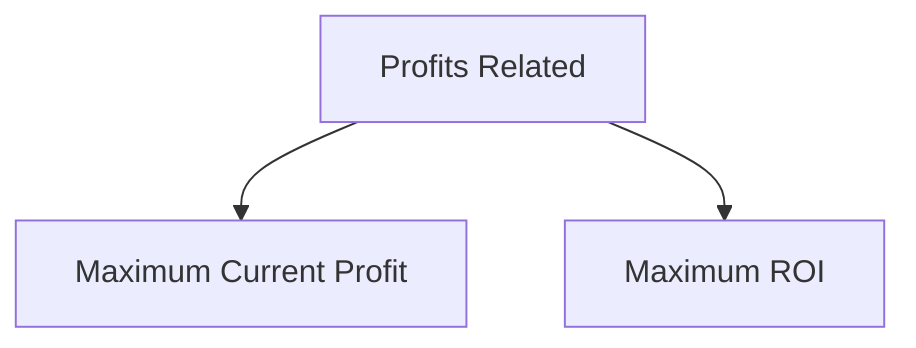
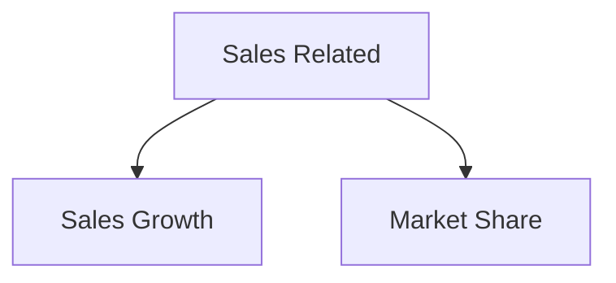
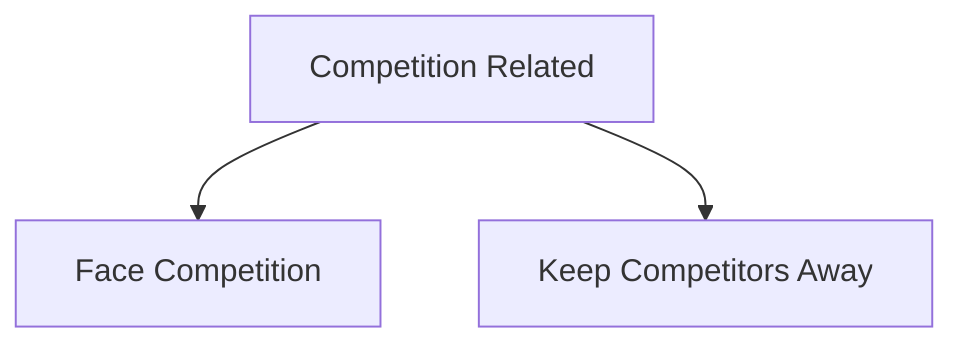
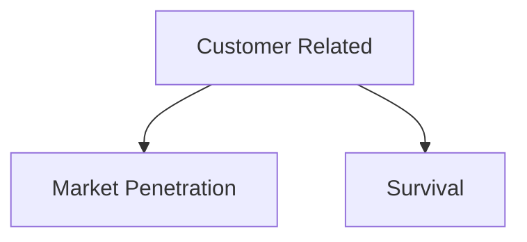

# Pricing Consideration and Approaches

## Pricing
Pricing is a crucial aspect of a business that directly impacts the revenue and profitability. It is the mechanism through which a business sets the price for its products and services based on various factors including cost of production, competitive landscape, and perceived value by consumers among others. The price is essentially the monetary value that consumers are willing to exchange for the benefits derived from the product or service.

{ width=75%}

According to Philip Kotler, "Price is the amount of money charged for a product or service." It is the sum of values that consumers exchange to enjoy the benefits of a product or service.

## Pricing Process (Setting a Price)
The process of pricing involves multiple steps to ensure that the price set is optimal for both the business and its customers. Here is a breakdown of the steps involved in the pricing process:

### 1. Selecting the Pricing Objective
- Determine the primary goal behind pricing - whether it is to maximize profit, gain market share, achieve a target return, or simply to cover costs.

### 2. Determining Demand
- Understand the demand curve for the product or service.
- Assess how the demand varies with changes in price.

### 3. Estimating Costs
- Calculate the total cost of producing the product including fixed and variable costs.
- Understanding the cost structure is vital to ensure that the price covers the costs and yields a profit.

### 4. Analyzing Competitors’ Costs and Prices
- Research and analyze the pricing strategies of competitors.
- Compare your cost structure and pricing with that of competitors to identify your competitive position.

### 5. Selecting a Pricing Method
- Choose a pricing method such as cost-plus pricing, value-based pricing, or competition-based pricing based on the business strategy and market conditions.
- The pricing method chosen should align with the pricing objective and market dynamics.

### 6. Setting the Final Price
- Based on the analysis conducted in the previous steps, set a price that meets the pricing objective, covers costs, and is competitive in the market.
- It's essential to ensure that the price set is acceptable to the target market and also sustainable for the business in the long term.

These steps in the pricing process provide a structured approach to setting prices that align with the business objectives and market conditions. Each step requires careful analysis and consideration to ensure that the final price set achieves the desired outcomes for the business while providing value to the customers.

## Pricing Objectives

Pricing objectives are crucial for any business, especially for SaaS companies. The right pricing strategy can make or break your business. This document outlines the different types of pricing objectives and why they are important. Pricing objectives serve as the foundational goals and framework that guide how a business prices its products or services. Without a well-defined pricing objective, businesses risk missing out on potential profits and customers.

## Types of Pricing Objectives

### 1. Profits Related Objectives

- **Maximum Current Profit**: Aim to set a price that maximizes current profits.
- **Maximum ROI**: The objective is to get the maximum Return on Investment.

### 2. Sales Related Objectives

- **Sales Growth**: The aim is to increase sales volume.
- **Market Share**: Strive to maintain or achieve a certain market share.

### 3. Competition Related Objectives

- **Face Competition**: Use price as a means to compete effectively.
- **Keep Competitors Away**: Set a low price to deter competitors.

### 4. Customer Related Objectives

- **Market Penetration**: Set lower prices to gain market share quickly.
- **Survival**: Willing to accept short-term losses for long-term viability.

### 5. Other

- **Price Stability**: Maintain a stable price for a long period of time.
