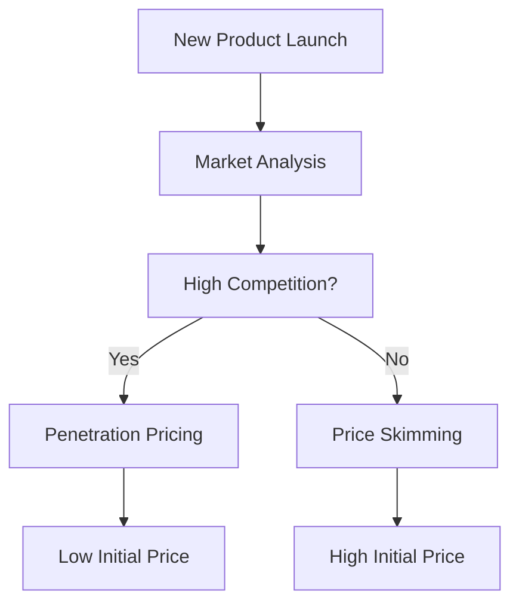

# New Product Pricing Strategies

New product pricing refers to the strategies and tactics employed to set the initial price for a new product entering the market. This is a crucial aspect of a product's launch as it can significantly impact consumer perception, market penetration, and profitability. The right pricing strategy can help a product gain a competitive edge, while a poorly chosen one can lead to low sales and revenue.

---

When it comes to pricing new products, businesses generally have two primary strategies to choose from: Price Skimming and Penetration Pricing. Each has its own set of advantages and disadvantages, and the choice often depends on various factors like the nature of the product, target audience, and market conditions.

## 1. Price Skimming
Price skimming is a pricing strategy where a high price is set for a new product, especially when the product has unique features or innovations that distinguish it from existing market offerings. This high price can help the company recover the costs of development quickly and is usually set during the introductory phase of the product lifecycle. Over time, as the market becomes more competitive or the product becomes more common, the price is gradually lowered to appeal to a broader segment of the market.

- **Benefits:** 
    - Quick recovery of development and marketing costs.
    - Establishes a premium brand image.
    - Exploits the willingness of early adopters to pay a higher price.

- **Drawbacks:**
    - May deter price-sensitive customers initially.
    - The high price may attract competitors to enter the market faster.
    
- **Example:** In the Indian market, electronic brands often use price skimming for new models of smartphones. They initially set a high price for the new models boasting unique features, and then reduce the price over time as newer models are introduced or competitors launch similar products.

## 2. Penetration Pricing
Penetration pricing is a strategy used to enter a market with a new product or service at a lower price point. The primary objective is to quickly gain market share and encourage the adoption of the product by a large number of consumers. The low introductory price serves to attract a significant customer base and establish a foothold in the market. Once market share is gained, prices may be gradually increased, or other products may be introduced at higher price points.

- **Benefits:** 
    - Rapid market share capture and customer base growth.
    - Discourages competition from entering the market.
    - Creates customer loyalty and builds word-of-mouth referrals.

- **Drawbacks:**
    - Initial profits may be lower or negligible.
    - May create a perception of low quality if not managed carefully.
    
- **Example:** Reliance Jio in India utilized penetration pricing by offering significantly lower data and call rates compared to competitors. This strategy quickly garnered a large user base and disrupted the telecom market, establishing Jio as a major player.