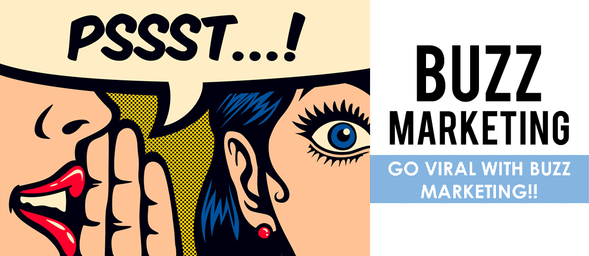
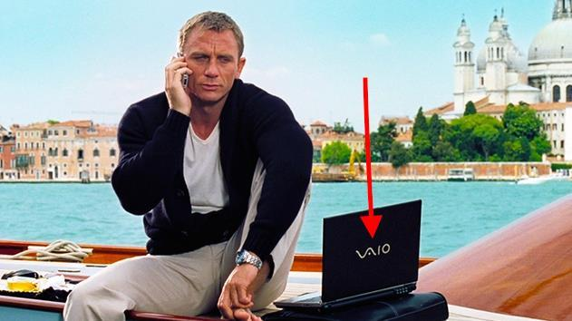
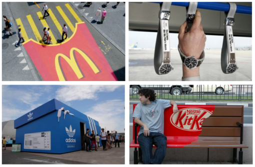

# Other Promotional Strategies

In the dynamic field of marketing, various innovative strategies are used to capture audience attention and promote products or services. Three such strategies are Buzz Marketing, Stealth Marketing, and Guerrilla Marketing. Each of these approaches has unique characteristics and application methods.

## Buzz Marketing

Buzz marketing focuses on creating excitement or "buzz" around a product or service, often leveraging word-of-mouth to spread information organically.

### Characteristics:
- Relies on high levels of excitement and engagement.
- Often uses social media, influencers, or notable events to generate conversations.
- Can be cost-effective as it relies on customers to spread the message.

### Example:
A classic example is the launch of a new smartphone by a leading tech company. The company may send early versions of the product to popular tech influencers. These influencers create content around the product, discussing its features and benefits, which their followers then share across social media platforms, creating a buzz.

## Stealth Marketing

Stealth marketing involves marketing a product to people without them realizing they are being marketed to.

### Characteristics:
- Subtle and often undercover approach.
- The audience is not explicitly aware that they are being targeted by a marketing campaign.
- Focuses on creating a natural and organic appeal.

### Example:
A beverage company might place its product in a popular TV show, where characters are seen enjoying the drink, but the product is not directly advertised. Viewers unconsciously register the brand, associating it with their favorite characters or scenes.

## Guerrilla Marketing

Guerrilla marketing is an unconventional and creative marketing strategy, often used by smaller businesses to obtain maximum exposure on a low budget.

### Characteristics:
- Highly creative, innovative, and often surprising.
- Utilizes public spaces and unconventional methods.
- Aims to create a memorable experience and strong impressions.

### Example:
A local cafe could create a street art mural that cleverly incorporates its branding. Passersby notice the unique art, and it becomes a talking point, encouraging them to visit the cafe.

In conclusion, these promotional strategies are designed to create impact and engagement in different ways. Buzz marketing harnesses the power of word-of-mouth, stealth marketing subtly integrates the product into content, and guerrilla marketing uses creativity and surprise to make a lasting impression. Each strategy can be highly effective when applied in the right context and to the appropriate target audience.
