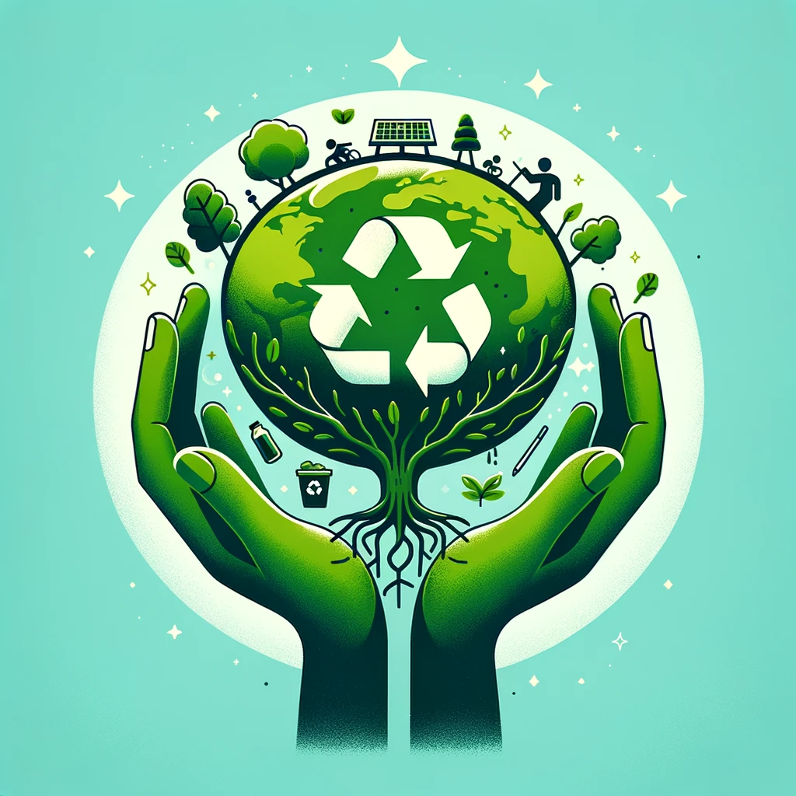

# Sustainable Marketing

Sustainable marketing is a holistic approach to marketing that prioritizes not only the company's immediate profitability but also its long-term impact on the environment, society, and economy. This concept is increasingly important as consumers and stakeholders become more conscious of the impact their choices have on the world. Here's a detailed explanation:

1. **Core Concept**: Sustainable marketing involves promoting products, services, and practices that are not only profitable but also socially responsible. It's about marketing in a way that considers the long-term well-being of the environment, society, and economy.

2. **Beyond Eco-Friendly Brands**: While naturally aligned with eco-friendly brands, sustainable marketing principles can be applied by any company, regardless of their core business. It’s about integrating sustainability into the overall marketing strategy.

3. **Environmental and Social Impact**: Sustainable marketing takes into account the environmental footprint and social impact of a company’s offerings. It's concerned with meeting the needs of the present without compromising the ability of future generations to meet their own needs.

4. **Counteracting Criticisms**: Sometimes, sustainable marketing is a strategic response to criticisms about pollution or misleading practices. It’s a way for companies to show responsibility and commitment to a broader set of values.

## Comparison with Traditional Marketing Mix
Traditional marketing focuses on the 4 Ps: Product, Place, Price, Promotion. Sustainable marketing reinterprets these elements:

1. **Customer Solution** (vs. Product): Focusing on providing solutions that meet customer needs in a sustainable manner.
2. **Customer Price** (vs. Price): Considering the long-term costs and value, not just the immediate price.
3. **Convenience** (vs. Place): Ensuring that the availability and distribution of products are efficient and environmentally friendly.
4. **Communication** (vs. Promotion): Engaging in transparent and honest communication about the company’s practices and impacts.

## Green Marketing vs. Sustainable Marketing
While related, green marketing and sustainable marketing are distinct:

1. **Green Marketing**: Primarily focuses on environmental aspects. It’s about promoting products or practices that are environmentally friendly, such as reducing carbon footprints or using recyclable materials.

2. **Sustainable Marketing**: Encompasses green marketing but extends to include social and economic dimensions. It involves creating marketing strategies that balance environmental concerns with social equity and economic viability.

## Key Takeaways
- Sustainable marketing is about balancing profit with environmental and social responsibility.
- It’s applicable to all businesses, not just those inherently eco-friendly.
- Sustainable marketing involves a broad view, considering not just environmental, but also social and economic impacts.
- This approach requires a shift from traditional marketing strategies, focusing more on long-term benefits and values.

Sustainable marketing represents a shift in how companies approach their role in society. It's not just about selling a product or service but about doing so in a way that contributes positively to the planet and its inhabitants. This strategy aligns with the increasing global emphasis on sustainability and corporate responsibility.